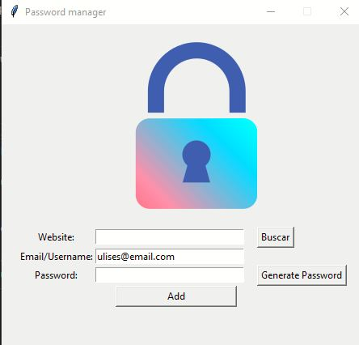
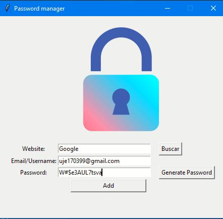
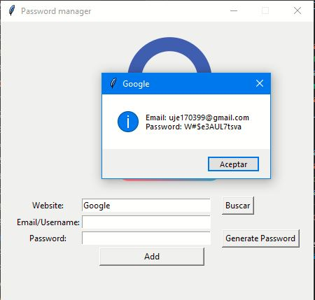

# Passwords-manager
En esta aplicacion el usuario podra llevar un registro de sus cuentas de manera local.

----

Debera indicar el sitio web al que pertenece la cuenta, por ejemplo Facebook. Despues debera indicar su correo electronico, y por ultimo ingresar su contraseña, si desea tener una contraseña fuerte podra generarla presionando el boton "generar contraseña" de manera automatica la contraseña se copiara en su portapapeles
solo debera pegarla en el sitio en donde desea ponerla. 

Por ultimo debera presionar "Add" para guardar esos datos de manera local en un archivo json

Si desea ver los datos de sus cuenta ya guardada debera escribir el nombre del sitio por ejemplo "Google" y presionar
el botón de buscar.

